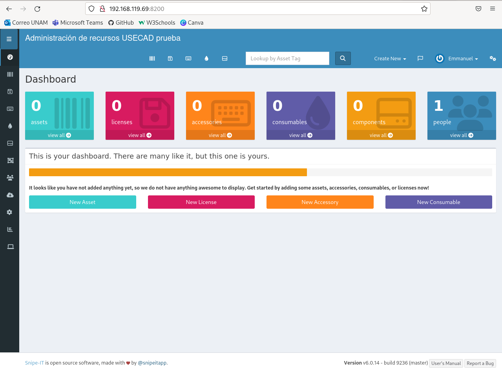

# DOCUMENTACIÓN SNIPE-IT
En este manual se cubrirá la información básica para la implementación con Docker y uso de Snipe-it.

## Índice<a name="inicio"></a>
- [¿Qué es Snipe-it y qué ofrece?](#definicion)
- [Implementación con Docker al servidor de pruebas Sofía](#implementacion)
  - [Descarga de Snipe-it](#descarga)
  - [Configuración de las variables de entorno](#env)
  - [Parámetros de MySQL](#parametros)
  - [Opciones de Snipe-it](#opciones)
  - [Creación e inicio del contenedor con MYSQL 5.6](#mysql)
- [Inicio del contenedor Snipe-it](#snipeit)
- [Página de set-up](#pagina_inicio)

## ¿Qué es Snipe-it y qué ofrece?<a name="definicion"></a>

<div class=text-justify>
Snipe-it, en pocas palabras, es un administrador de recursos (licencias, equipos, consumibles, componentes y accesorios) de licencia abierta en formato de aplicación web. La manera de permitir agregar, quitar, editar y ver los recursos hace de Snipe-it una de las aplicaciones de manejo de recursos más usadas por empresas y escuelas.
  
Las bondades que ofrece Snipe-it son las siguientes:
* Administrar equipos, accesorios, licencias y consumibles.
* Controlar fechas de expiración de liciencias, mantenimiento de equipos, accesorios y componentes y fechas de compra de recursos.
* Tener registro de las empresas a las que se les adiquiró recursos.
* Poder consultar en todo momento el número de serie del equipo, licencia o accesorio en cuestión, en el caso de la licencia la clave de activación y el equipo donde fue aplicada.
* Marcar los recursos como almacenados, pendientes de entrega y listos para usar.
* Identificar con facilidad los recursos mediante el uso de imágenes.
* Importar archivos CSV.
* Crear reportes de actividad, auditoría, amortización, licencias, mantenimiento de equipos.
* Tener un control de calidad sobre los activos, por medio de no conformidades.
* Tener flexibilidad en el reporte de equipos.
* Registrar el préstamo de equipos, así como las fechas esperadas de devolución, su estado y la localización esperada de ellos.
* Asignación de recursos.
</div>

[Regresar al índice](#inicio)

## Implementación con Docker al servidor de pruebas Sofía <a name="implementacion"></a>
La implementación de Snipe-it a cualquier servidor (en este caso Sofía) por medio de Docker, se requiere seguir una serie de pasos, los cuáles a continuación se mostrarán:

### Descarga de Snipe-it <a name="descarga"></a>
                                           
Para descarga del hub de Docker la imagen más reciente de Snipe-it en Docker se usa el siguiente comando:
<br>`docker pull snipe/snipe-it`</br>
Y para comprobar que efectivamente se completó la descarga y esté disponible en Docker se usa el siguiente comando:
<br>`docker images`</br>
El cuál al ejecutarlo nos mostrará todas las imágenes disponibles, siendo la de nombre snipe/snipe-it la de mayor interés por este momento:


### Configuración de las variables de entorno <a name="env"></a>
Snipe-it requiere de la creación de un archivo```.env```para poder funcionar. Para ello vamos a crear un archivo de extensión```.env```con el siguiente comando:

```
nano nombre_del_archivo.env
```

Se desplegará en la terminal el siguiente editor de texto:


En el cuál pegaremos lo siguiente:

```
# Mysql Parameters
MYSQL_ROOT_PASSWORD=YOUR_SUPER_SECRET_PASSWORD
MYSQL_DATABASE=snipeit
MYSQL_USER=snipeit
MYSQL_PASSWORD=YOUR_snipeit_USER_PASSWORD

# Email Parameters
# - the hostname/IP address of your mailserver
MAIL_PORT_587_TCP_ADDR=smtp.whatever.com
#the port for the mailserver (probably 587, could be another)
MAIL_PORT_587_TCP_PORT=587
# the default from address, and from name for emails
MAIL_ENV_FROM_ADDR=youremail@yourdomain.com
MAIL_ENV_FROM_NAME=Your Full Email Name
# - pick 'tls' for SMTP-over-SSL, 'tcp' for unencrypted
MAIL_ENV_ENCRYPTION=tcp
# SMTP username and password
MAIL_ENV_USERNAME=your_email_username
MAIL_ENV_PASSWORD=your_email_password

# Snipe-IT Settings
APP_ENV=production
APP_DEBUG=false
APP_KEY=<<Fill in Later!>>
APP_URL=http://127.0.0.1:YOUR_PORT_NUMBER
APP_TIMEZONE=US/Pacific
APP_LOCALE=en
  
# Docker-specific variables
PHP_UPLOAD_LIMIT=100
```

#### Parámetros de MySQL<a name="parametros"></a>
Para configurar los parámetros de MySQL vamos a entender primero cada uno de ellos:
````
MYSQL_ROOT_PASSWORD=
````
Este parámetro indica la contraseña que va a pedir MySQL cuando se quiera acceder al contenedor del mismo por medio de la consola de comandos para modificar las bases de datos, permisos, usuarios, etc.

```
MYSQL_DATABASE=
```
Es el nombre de la base de datos de MySQL que Snipe-it va a crear y usar. Es recomendable dejarla con el valor de `snipeit`.

```
MYSQL_USER=
````
Es el usuario por default a crear en MySQL.

```
MYSQL_PASSWORD=
```
Es la contraseña del usuario creado anteriormente.

#### Opciones de Snipe-it<a name="opciones"></a>
En este apartado vamos a cambiar lo siguiente:
```
APP_URL=http://127.0.0.1:YOUR_PORT_NUMBER
```
En lugar de `127.0.0.1`colocaremos la dirección ip del servidor de pruebas Sofía, el cuál al día 17 de febrero de 2023 es `192.168.119.69`y cómo puerto se pondrá uno desponible (preguntar a los encargados de servicio social sobre qué puertos usar y cuáles no).

`APP_TIMEZONE=US/Pacific`y`APP_LOCALE`especifican la zona horaria y el idioma de la aplicación respectivamente. Para la Ciudad de México la zona horaria es `America/Mexico_City` y el idioma es `es-ES`

¡Y listo! Ya tenemos configuradas las variables de entorno de nuestra aplicación, por lo que podemos empezar a correr el contenedor MySQL, procedimiento que se verá a continuación.

### Creación e inicio del contenedor con MYSQL 5.6<a name="mysql"></a>
El comando para iniciar el contenedor MySQL es el siguiente:
```
docker run --name snipe-mysql --env-file=my_env_file --mount source=snipesql-vol,target=/var/lib/mysql -d -P mysql:5.6
```
Donde: 
* `--name` indica el nombre del contenedor.
* `--env-file`es el nombre del archivo.
* `.env` que creamos en un principio.
* `snipesql-vol` es el volumen de Snipe-it que se crea para MySQL.
* `-d` es la indicación para ocultar el log del comando que se ejecutó.
* `mysql:` es la versión de MySQL a usar.

>ATENCIÓN: Es importante usar la versión de MySQL menor o igual a 5.6, pues si se usa una mayor Snipe-it no va a conectarse con MySQL debido a que estas corren en modo estricto por default.


Una vez puesto en marcha el comando, la terminal debería de mostrar lo siguiente:


Los números que entrega la terminal es el ID del contendor. Para revisar si está en linea usamos el comando `docker ps` y debería de aparecer la ID que vimos anteriormente con el nombre del contenedor que pusimos en el comando de creación del contenedor MYSQL, en este caso: `snipe-mysql`.


Cómo se muestra en la terminal, quiere decir que nuestra base de datos ya se encuentra en línea en el servidor y lista para ser usada por Snipe-it.

[Regresar al índice](#inicio)

## Inicio del contenedor Snipe-it<a name="snipeit"></a>
Iniciar el contenedor Snipe-it requiere de la generación de un APP_KEY, el cuál se va a generar mediante el siguiente comando:
`docker run --rm snipe/snipe-it`

No nos va a dejar iniciar el contenedor, pues nos dice que hace falta generar un APP_KEY para usar en el archivo .env, seguido de un ejemplo de APP_KEY que perfectamente podemos usar:


Vamos a copiar la clave que generó la terminal y la vamos a pegar en el apartado `APP_KEY=` que está dentro del archivo `.env` que creamos y editamos hace unos momentos:


Una vez hecho esto, podemos correr nuestro contenedor Snipe-it con el siguiente comando:
```
docker run -d -p YOUR_PORT_NUMBER:80 --name="snipeit" --link snipe-mysql:mysql --env-file=my_env_file --mount source=snipe-vol,dst=/var/lib/snipeit snipe/snipe-it
```

donde:
* `YOUR_PORT_NUMBER` es el puerto que previamente colocamos en el archivo `.env`.
* `snipeit` es el nombre que le vamos a poner al contenedor
* `--link snipe-mysql:mysql` es la indicación de que vamos a conectar el contenedor de Snipe-it con el contenedor de MySQL que creamos anteriormente.
* `--env-file`es el archivo `.env` que creamos previamente.

De tal suerte que si lo editamos correctamente, vamos a poder ver lo siguiente en la terminal:


Y al usar nuevamente el comando `docker ps`apreciaremos que está en línea el contenedor Snipe-it:


[Regresar al índice](#inicio)

## Página de set-up<a name="pagina_inicio"></a>
Si hicimos todo bien, al ingresar a la dirección que pusimos en nuestro archivo `.env` desde nuestro navegador preferido, podremos ver el pre-flight de Snipe-it, es decir, la configuración inicial de la app en si de manera mucho más intuitiva.


Aquí nos indicará Snipe-it si hay algún problema con la configuración inicial, se mostrará de color rojo junto con la descripción del problema. Para consultar los problemas más comunes con su solución podemos visitar el FAQ de Snipe-it con la siguiente liga:
<a href="https://snipe-it.readme.io/docs/common-issues">Problema comunes con la instalación de Snipe-it</a>

Al continuar con los siguientes pasos en la página de Snipe-it, llegaremos a una página donde tenemos que configurar aspectos básicos de la aplicación, cómo lo son:
* Nombre del sitio de Snipe-it, por ejemplo: Adminisitración de recursos USECAD.
* Idioma de la app.
* Moneda.
* Extensión de los ID's de los recursos.

Así como el dominio de los correos que se van a usar en la aplicación y el estilo de los correos a partir de los nombres de las personas. También pedirá nombre y apellido para el perfil del usuario inicial, su correo, usuario a usar dentro de Snipe-it y una contraseña para ingresara a dicho perfil.


Al terminar con la configuración, puede aparecer `500 web server error`, no pasa nada, solo basta con entrar de nuevo a la dirección ip y debería de aparecer la página de inicio de Snipe-it.



## Agregar modelos de equipos, consumibles o componentes
1. Sobre la barra de opciones de la página inicio hacer click sobre la barra y seleccionar el engrane de opciones.
2. Dar click en "Modelos".
3. Seleccionar "Crear localización".
4. Aparecerá la siguiente página con información a llenar:

Aquí podremos agregar el fabricante, la categoría en la que está (puede ser laptop, PC, impresora, etc. el límite es tu imaginación), el número de modelo e incluso la depreciación del equipo si es que se le va a tomar en cuenta (la amortización se explicará más tarde).
5. Podremos agregar una imagen para identificar al equipo rápidamente.
6. Finalmente daremos click en guardar.

## Agregar equipos<a name="equipos"></a>
Para agregar equipos se tiene que hacer lo siguiente:
1. En la página de inicio dar click derecho sobre las barra laterar para desplegar las opciones
2. Elegir "Equipos" seguido de "Listar todo"


[Regresar al índice](#inicio)


